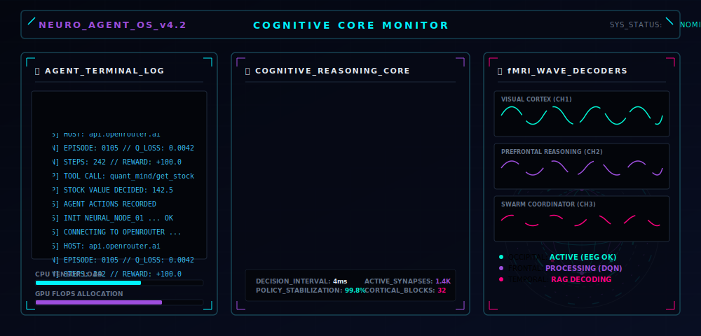
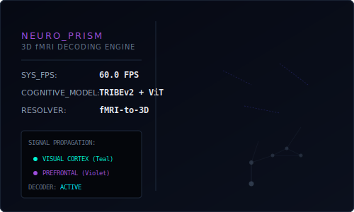
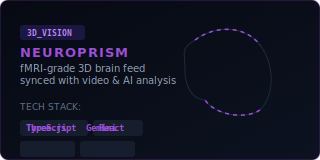
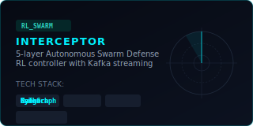
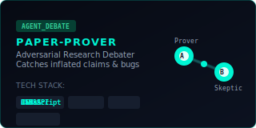

<p align="center">
  
</p>

<p align="center">
  <em>AI Engineer building autonomous systems that think, learn, and reason.</em><br>
  <strong>Reinforcement Learning • Agentic AI • MCP • Computational Neuroscience • Computer Vision</strong>
</p>

<p align="center">
  <a href="https://linkedin.com/in/NikhilChapkanade"></a>
  <a href="https://instagram.com/i_am_nikkhil"></a>
  <a href="mailto:nikhilchapkanade@gmail.com"></a>
</p>

---

### 🧠 About Me

```python
class Nikhil:
    location   = "Pune, India 📍"
    role       = "AI/ML Engineer"
    
    core_stack = ["Agentic AI", "Reinforcement Learning", "MCP Protocol",
                  "Computer Vision", "Computational Neuroscience"]
    devops     = ["AWS (EC2 • S3 • Lambda)", "Docker", "MLOps", "CI/CD"]
    building   = "Autonomous systems that learn, reason, and act"
    exploring  = "LangGraph • Stable-Baselines3 • Causal AI • Kafka • Three.js"
    
    latest     = "🧠 NeuroPrism — fMRI-grade 3D brain visualization with Meta TRIBEv2"
    
    loading_next = ["☁️ AWS Certified Solutions Architect",
                    "🔄 Full MLOps Pipeline (MLflow + DVC + Airflow)",
                    "🤖 Multi-Agent Production Systems"]
    
    def __repr__(self):
        return "shipping code that thinks for itself 🚀"
```

<p align="center">
  
  
</p>

---

<h3 align="center">🚀 Featured Projects</h3>

<p align="center">
  <a href="https://github.com/Nikhilchapkanade/NeuroPrism">
    
  </a>
  <a href="https://github.com/Nikhilchapkanade/INTERCEPTOR">
    
  </a>
  <a href="https://github.com/Nikhilchapkanade/Paper-Prover">
    
  </a>
</p>

#### 📂 Other Notable Repositories

*   📈 **[quant-mind](https://github.com/Nikhilchapkanade/quant-mind)** - Financial agent with deep learning stock prediction running as an MCP server inside Claude.
*   🔗 **[MCP-CLI](https://github.com/Nikhilchapkanade/MCP-CLI)** - MCP client using Python and OpenRouter for tool-augmented LLM interactions.
*   🎨 **[ClaudeVision](https://github.com/Nikhilchapkanade/ClaudeVision)** - Bridge between Claude Desktop and ComfyUI — generate AI images on-demand with zero-GPU cloud architecture.
*   👁️ **[YOLO26n](https://github.com/Nikhilchapkanade/YOLO26n)** - Real-time vehicle detection, tracking & counting using the latest YOLO26 model.
*   🧬 **[Skill-LLM](https://github.com/Nikhilchapkanade/Skill-LLM)** - Hot-swapping LoRA adapters for multi-task LLM specialization.
*   📚 **[BigDoc-Server](https://github.com/Nikhilchapkanade/BigDoc-Server)** - MCP server for recursive LLM reasoning — unlimited context via search, code, and think tools.
*   🔌 **[Mcp-Core](https://github.com/Nikhilchapkanade/Mcp-Core)** - RAG agent with MCP and Llama 3.2 — instantly connects tools and knowledge base.

---

<h3 align="center">🛠️ Tech Arsenal</h3>

<p align="center">
  
</p>

---

<h3 align="center">📊 GitHub Activity &amp; Analytics</h3>

<p align="center">
  
  
</p>

<p align="center">
  
</p>

<p align="center">
  
</p>

---

<p align="center">
  
</p>
